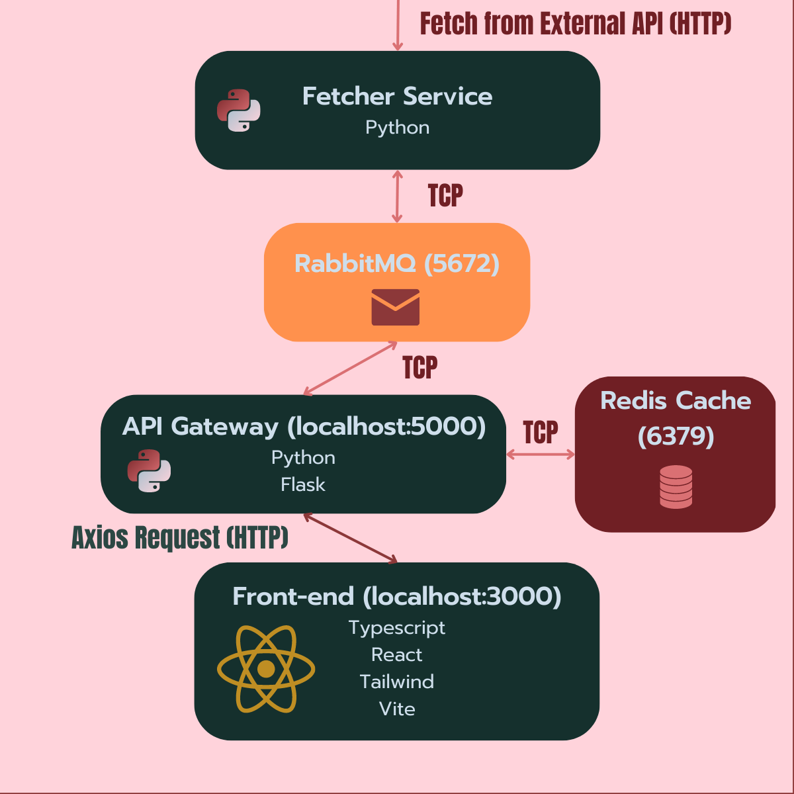

<p align="center">
  <a href="" rel="noopener">
 </a>
</p>

<div align="center">

[](#)
[](#coverage-report)
[](https://github.com/hoxas/stocks/issues)
[](https://github.com/hoxas/stocks/pulls)
[](/LICENSE)

</div>

---

<p align="center"> Stock price fetching web app with a monorepo microservices architecture.
    <br> 
</p>

## 📝 Table of Contents

- [📝 Table of Contents](#-table-of-contents)
- [🧐 About ](#-about-)
  - [Architecture Overview](#architecture-overview)
  - [Folder Structure](#folder-structure)
- [🏁 Getting Started ](#-getting-started-)
  - [Prerequisites](#prerequisites)
  - [Installing](#installing)
- [🔧 Running the tests ](#-running-the-tests-)
  - [How to](#how-to)
  - [Coverage Report](#coverage-report)
- [🎈 Usage ](#-usage-)
- [⛏️ Built Using ](#️-built-using-)
- [✍️ Authors ](#️-authors-)

## 🧐 About <a name = "about"></a>

A Web App that displays stock prices, made to study microservices architecture with RabbitMQ and Docker containerization.

### Architecture Overview



### Folder Structure

```
stocks
├─ .dockerignore
├─ .gitignore
├─ api
│  ├─ Dockerfile
│  ├─ __init__.py
│  ├─ main.py
│  └─ requirements.txt
├─ common
│  ├─ __init__.py
│  └─ rmq.py
├─ docker-compose.yaml
├─ fetcher
│  ├─ Dockerfile
│  ├─ __init__.py
│  ├─ main.py
│  └─ requirements.txt
├─ frontend
│  ├─ Dockerfile
│  ├─ index.html
│  ├─ package-lock.json
│  ├─ package.json
│  ├─ postcss.config.cjs
│  ├─ public
│  │  └─ stocks.svg
│  ├─ src
│  │  ├─ App.css
│  │  ├─ App.tsx
│  │  ├─ assets
│  │  │  └─ stocks.svg
│  │  ├─ components
│  │  │  ├─ Dashboard.tsx
│  │  │  ├─ Main.tsx
│  │  │  ├─ Navbar.tsx
│  │  │  ├─ SelectedStock.tsx
│  │  │  ├─ StockList.tsx
│  │  │  └─ StockListItem.tsx
│  │  ├─ index.css
│  │  ├─ main.tsx
│  │  └─ vite-env.d.ts
│  ├─ tailwind.config.cjs
│  ├─ tsconfig.json
│  ├─ tsconfig.node.json
│  └─ vite.config.ts
├─ test.py
└─ tests
   ├─ __init__.py
   ├─ test_api_main.py
   ├─ test_common_rmq.py
   └─ test_fetcher_main.py

```

## 🏁 Getting Started <a name = "getting_started"></a>

These instructions will get you a copy of the project up and running on your local machine for development and testing purposes.

### Prerequisites

```
Essentials:

Docker
Docker Compose (If it didn't come with your docker version)

------------------------------
Optionals:

Git (To clone the project)
Python 3.11* (If you want to run the tests)
```

\* Python version I tested with, but **might** work just fine with older versions.

### Installing

How to setup your dev env

Clone repo & cd into it

```
git clone https://github.com/hoxas/stocks && cd stocks
```

Run docker-compose.yaml

```
docker compose up
```

Docker Compose should build the apps images and run the containers for you, wait a couple seconds to make sure everything is up as it should.

Access the web app on the default url through your browser of choice:

```
http://localhost:3000
```

Test the app by typing a ticker in the search bar and pressing enter

## 🔧 Running the tests <a name = "tests"></a>

To run the automated tests you're gonna need python installed locally with venv. **(Recommended and tested with Python 3.11)**

### How to

Simply run scripts/tests.py and it will create a venv in the repo folder for you, install requirements in the venv and run the tests.

```
python3.11 scripts/tests.py
```

### Coverage Report

Virtually 100% coverage as I left out the "if \_\_name\_\_ == \_\_main\_\_" testing as I saw no real need for it and also chose not to add it to the coverage ignore.

<table class="index" data-sortable>
    <thead>
        <tr class="tablehead" title="Click to sort">
            <th class="name left" aria-sort="none" data-shortcut="n">Module</th>
            <th aria-sort="none" data-default-sort-order="descending" data-shortcut="s">statements</th>
            <th aria-sort="none" data-default-sort-order="descending" data-shortcut="m">missing</th>
            <th aria-sort="none" data-default-sort-order="descending" data-shortcut="x">excluded</th>
            <th class="right" aria-sort="none" data-shortcut="c">coverage</th>
        </tr>
    </thead>
    <tbody>
        <tr class="file">
            <td class="name left">api/__init__.py</td>
            <td>0</td>
            <td>0</td>
            <td>0</td>
            <td class="right" data-ratio="0 0">100%</td>
        </tr>
        <tr class="file">
            <td class="name left">api/main.py</td>
            <td>43</td>
            <td>1</td>
            <td>0</td>
            <td class="right" data-ratio="42 43">98%</td>
        </tr>
        <tr class="file">
            <td class="name left">common/__init__.py</td>
            <td>0</td>
            <td>0</td>
            <td>0</td>
            <td class="right" data-ratio="0 0">100%</td>
        </tr>
        <tr class="file">
            <td class="name left">common/rmq.py</td>
            <td>21</td>
            <td>0</td>
            <td>0</td>
            <td class="right" data-ratio="21 21">100%</td>
        </tr>
        <tr class="file">
            <td class="name left">fetcher/__init__.py</td>
            <td>0</td>
            <td>0</td>
            <td>0</td>
            <td class="right" data-ratio="0 0">100%</td>
        </tr>
        <tr class="file">
            <td class="name left">fetcher/main.py</td>
            <td>25</td>
            <td>1</td>
            <td>0</td>
            <td class="right" data-ratio="24 25">96%</td>
        </tr>
        <tr class="file">
            <td class="name left">tests/__init__.py</td>
            <td>0</td>
            <td>0</td>
            <td>0</td>
            <td class="right" data-ratio="0 0">100%</td>
        </tr>
        <tr class="file">
            <td class="name left">tests/test_api_main.py</td>
            <td>105</td>
            <td>0</td>
            <td>0</td>
            <td class="right" data-ratio="105 105">100%</td>
        </tr>
        <tr class="file">
            <td class="name left">tests/test_common_rmq.py</td>
            <td>41</td>
            <td>0</td>
            <td>0</td>
            <td class="right" data-ratio="41 41">100%</td>
        </tr>
        <tr class="file">
            <td class="name left">tests/test_fetcher_main.py</td>
            <td>38</td>
            <td>0</td>
            <td>0</td>
            <td class="right" data-ratio="38 38">100%</td>
        </tr>
    </tbody>
    <tfoot>
        <tr class="total">
            <td class="name left">Total</td>
            <td>273</td>
            <td>2</td>
            <td>0</td>
            <td class="right" data-ratio="271 273">99%</td>
        </tr>
    </tfoot>
</table>

## 🎈 Usage <a name="usage"></a>

Add notes about how to use the system.

## ⛏️ Built Using <a name = "built_using"></a>

- [Typescript](https://www.typescriptlang.org/) - Front-end Language
- [React](https://react.dev/) - Front-end Framework
- [Tailwind](https://tailwindcss.com/) - CSS Framework
- [Vite](https://vitejs.dev/) - Front-end Build Tool
- [Python](https://www.python.org/) - Back-end Language
- [Flask](https://flask.palletsprojects.com/) - Gateway API Framework
- [Redis](https://redis.io/) - Gateway API Caching
- [RabbitMQ](https://www.rabbitmq.com/) - Message Broker for Back-end Apps

## ✍️ Authors <a name = "authors"></a>

- [@hoxas](https://github.com/hoxas) - Project Creator

<!-- See also the list of [contributors](https://github.com/hoxas/stocks/contributors) who participated in this project.

## 🎉 Acknowledgements <a name = "acknowledgement"></a>

- Hat tip to anyone whose code was used
- Inspiration
- References -->
